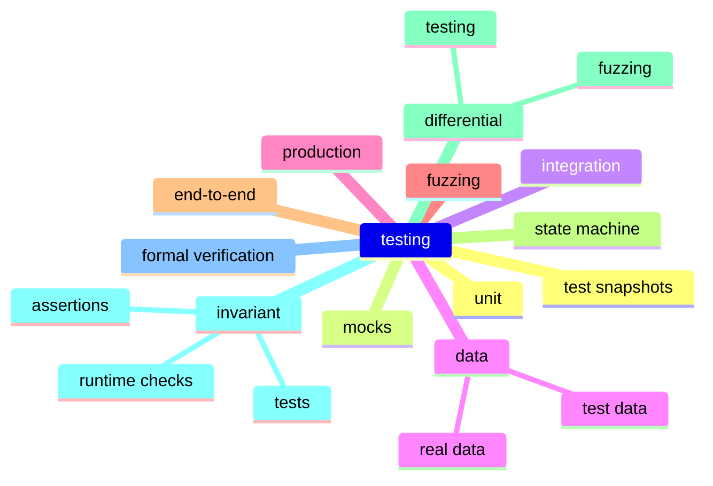

# definitive guide testing smart contracts

leighm.cc/talks/dgtsc

---


## leigh

software engineer
stellar development foundation

<i class="fa fa-twitter"></i> _ _ _ leigh _ _ _

---

## why test?

<!--
why testing
best practice
build confidence in the programs we develop
failure has a cost
prevent cost
give others confidence
confidence in changes not just existing capabilities
confidence at new protocol releases
confidence when dependencies upgrade
-->

---

## stellar, what's different?

<!--
a consistent theme with smart contracts on Stellar is that we have tried to learn from other blockchains:
 - what hasn't worked for them
 - what has worked
 - what's the best way to build great tooling
 - what's are the behaviors that are effective at building reliable and safe contracts
 - what gives developers confidence

And a huge area of that was... we needed to be intentional about testing

- one language to write contracts and tests
- less context switching between different development environments
- unit, integration, fuzz, all tests written in rust
- byo rust tooling (most, not everything works out-of-the-box)
- leverage an entire ecosystem of test capabilities
-->

---

## what is testing?



<!--
testing is so many things
-->

---

## ⚠️

code displayed is

illustrative :frame_with_picture: 
buggy :bug: 
unaudited :cry: 

---

## token contract

```rust=1
#![no_std]
use soroban_sdk::*;

#[contract]
pub struct Token;

#[contracterror]
#[derive(Clone, Copy)]
pub enum Error {
    Overflow = 1,
}

#[contractimpl]
impl Token {
```

---

## code

```rust=15
// Initialize the token with an initial mint.
pub fn __constructor(env: &Env, id: Address, bal: i128>) {
    env.storage().persistent().set(&id, &bal);
}
```

---

## code

```rust=20
// Get the balance held by the address.
pub fn balance(env: &Env, id: Address) -> i128 {
    env.storage().persistent().get(&id).unwrap_or(0)
}
```

---

## code

```rust=25
// Transfer `amount` from `from` to `to`.
// Requires auth from `from`.
pub fn transfer(env: &Env, from: Address, to: Address, amount: i128) -> Result<(), Error> {
    from.require_auth();
    env.storage().persistent().try_update(&from, |bal: Option<i128>| {
        // 👇 WARNING: BUGS LIVE HERE 👇
        bal.unwrap_or(0).checked_sub(amount).ok_or(Error::Overflow)
    })?;
    env.storage().persistent().try_update(&to, |bal: Option<i128>| {
        bal.unwrap_or(0).checked_add(amount).ok_or(Error::Overflow)
    })?;
    Ok(())
}
```

---

## unit tests

```rust
#[test]
fn test() {
    let env = Env::default();
    let a = Address::generate(&env);
    let id = env.register(Token, (&a, 10i128));
    let token = TokenClient::new(&env, &id);
    
    assert_eq!(token.balance(&a), 10);
}
```

<!--
 - write in rust
 - create an env, register contract, call it
-->

---

## mocks

<!--
 - can mock in unit tests, integration tests (which we'll get to next), fuzz tests
 - sdk provides ways to mock contracts, addresses
 - if your contract calls another contract, write a mini replacement with the same interface and register it
 - or use mockall or another mocking fwk (note that only static fns mocking is supported, so there's some constraints, but watch this space)
-->

---

## mock all auths

```rust
#[test]
fn test() {
    let env = Env::default();
    let a = Address::generate(&env);
    let id = env.register(Token, (&a, &10i128));
    let token = TokenClient::new(&env, &id);
    
    let b = Address::generate(&env);
    token.mock_all_auths().transfer(&a, &b, &3)
    
    assert_eq!(client.balance(&a), 7);
    assert_eq!(client.balance(&b), 3);
}
```

---

## mock one auth

```rust
    // ...
    token
        .mock_auth(&[MockAuth{
            address: &a,
            invoke: &MockAuthInvoke{
                contract: &token,
                fn_name: "transfer",
                args: (&a, &b, 3).into_val(&env),
                sub_invokes: &[],
            },
        }])
        .transfer(&a, &b, &3)
    
    assert_eq!(client.balance(&b), 3);
```

---

## mock contracts

```rust
#[contract]
struct MockPause;

#[contractimpl]
impl MockPause {
    pub fn paused() -> bool { false }
}
```
```rust
#[test]
fn test() {
    let env = Env::default();
    let pause_id = env.register(MockPause, ());
    let id = env.register(Token, (&pause_id, ..));
    // ...
}
```

---

## mock with mockall

```rust
#[contract]
struct MockPause;

mockall::mock! {
    pub Fns {
        pub fn paused() -> bool;
    }
}

#[contractimpl]
impl MockPause {
    pub fn paused() -> bool { MockFns::paused() }
}
```
```rust
#[test]
fn test() {
    let env = Env::default();
    let pause_id = env.register(MockPause, ());
    let id = env.register(Token, (&pause_id, ..));
    
    let mock_paused_ctx = MockFns::paused_context();
    mock_paused_ctx.expect().returning(|| true);
    
    // ...
}
```

---

## integration tests

```console
$ stellar contract fetch --id C... -o pause.wasm
```
```rust
mod pause {
    soroban_sdk::contractimport!("pause.wasm")
}
```
```rust
#[test]
fn test() {
    let env = Env::default();
    let pause_id = env.register(pause::WASM, ());
    let id = env.register(Token, (&pause_id, ..));
    // ...
}
```

<!--
 - integration testing is testing real logic, but with test data
 - if a dep is too complex to mock, or you just don't love mocks (hand up)
 - test against the actual dependency
 - stellar contract fetch to download the .wasm file
 - import the .wasm file
 - register the .wasm file in tests, and the actual code will be called
-->

---

snapshot testing

```console
$ stellar snapshot create --network testnet --id C... --format json
```
```rust
#[test]
fn test() {
    let env = Env::from_ledger_snapshot("snapshot.json");
    let pause_id = Address::from_str(&env, "C...");
    let id = env.register(Token, (&pause_id, ..));
    // ...
}
```

<!--
 - snapshot testing is another form of integration testing, but going a step further. not only will the test use actual code for the dependencies, it'll also use their actual data from testnet or mainnet.
 - stellar snapshot create --ledger --address Cdep...
 - import the snapshot
 - write tests against the actual contract with some actual real data
 - when to use this?
   - complex deps that you want to understand better
   - complex deps that you want to include in your tests or fuzzes for more realistic expectations and outcomes
   - limited to point-in-time snapshots, have to update snashots manually if you want newer data on some cadence
   - good throw away tool for debugging, if you have a bug that you don't understand, take a snapshot, and test against the state
     - then use that test to confirm the bug is fixed
-->

---

## fuzz testing

<!--
 - identify unexpected failures
   - failures always rollback, unless you try invoke another contract then its failures won't necessarily depending on what your contract does with the error returned
   - more about identifying failures that might mean your contract is pegged in some state
 - identify guarantees that aren't always true, and might not be true in cases not considered
 - use cargo-fuzz
 - inputs to fuzz tests are randomly generated
 - all sdk types can be inputs to fuzz tests
-->

---

## end-to-end testing
<!--
 - run quickstart in ci
-->

---

## differential testing / fuzzing

<!--
 - contracts change over time
 - goal is to identify changes
 - write your tests so they can be run over multiple versions of your contract
 - run tests on past deployed wasms
 - compare results against native build
-->

---

## invariant testing

<!--
 - not really practical to do at runtime, don't have access to all data, can't do invariant testing like "all balances add to N" or all contracts are "Y"
 - can write invariant tests about the data loaded in a single invocation
 - forces you to say what is always true, what guarantees does your contract make
 - debug_assert in code
 - run a function at the end of every test to check that the contract state fits some rules
-->

---

## formal verification

:mega: see chandra's talk

---


